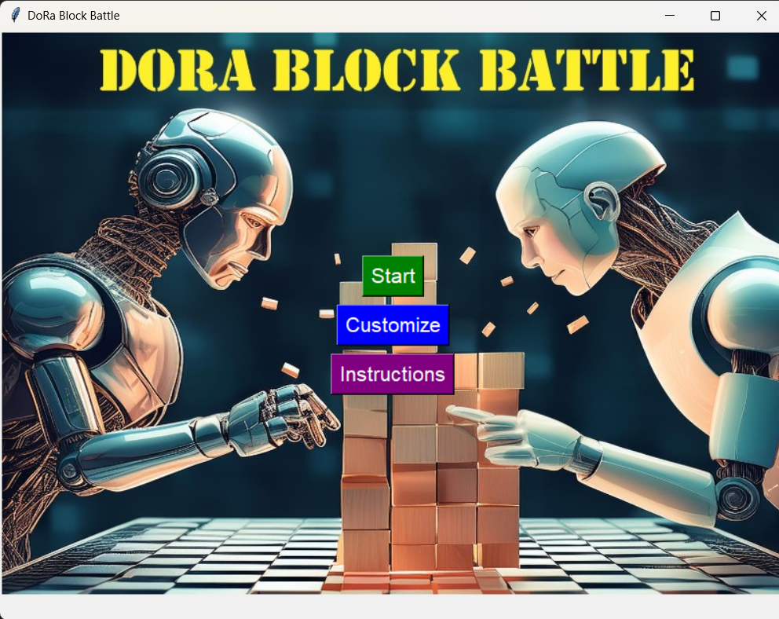
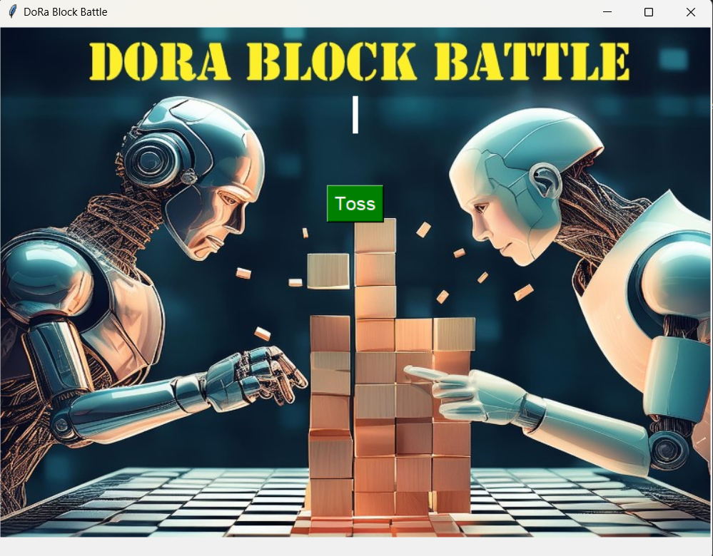
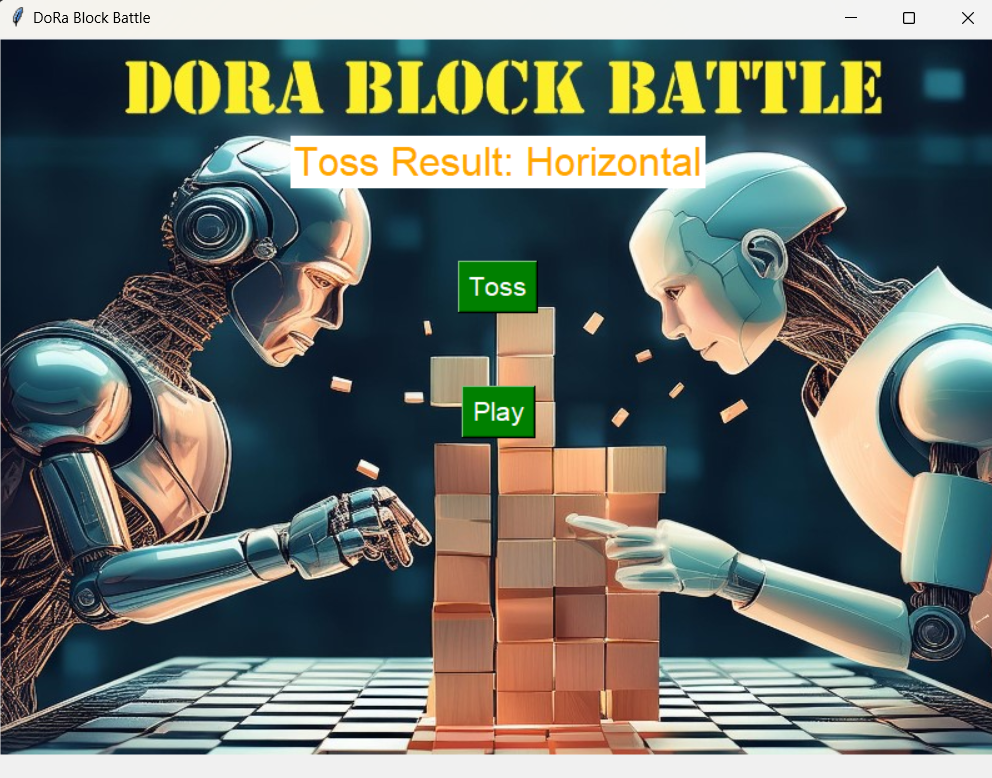
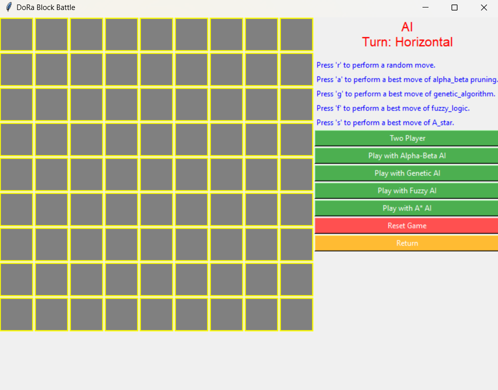
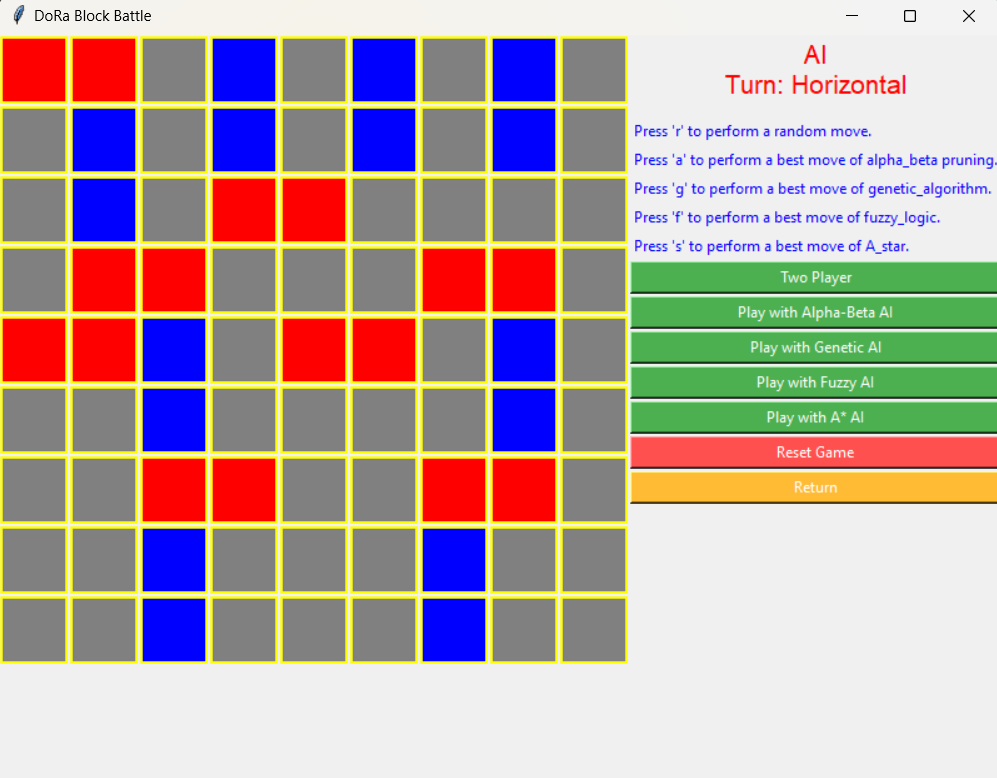
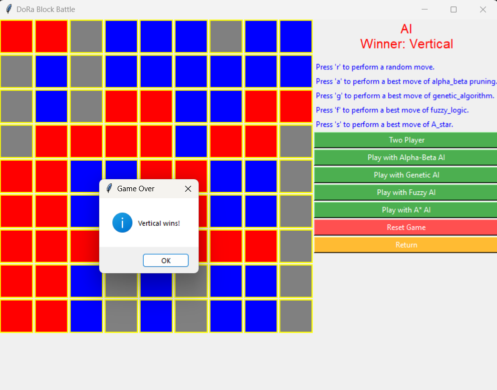
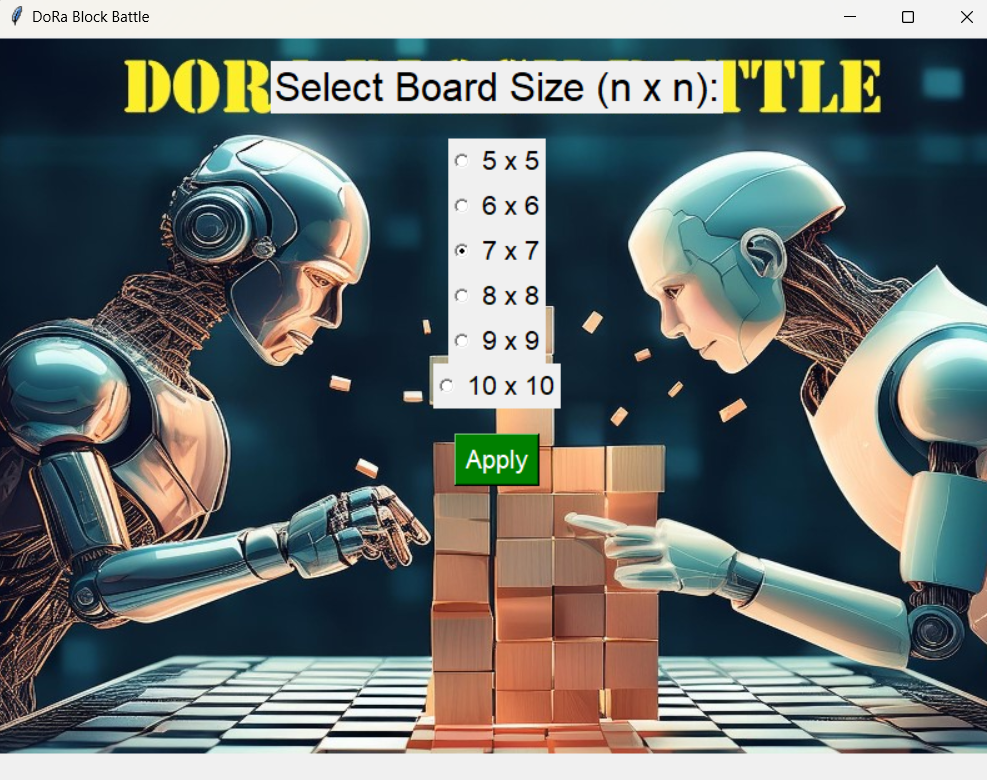
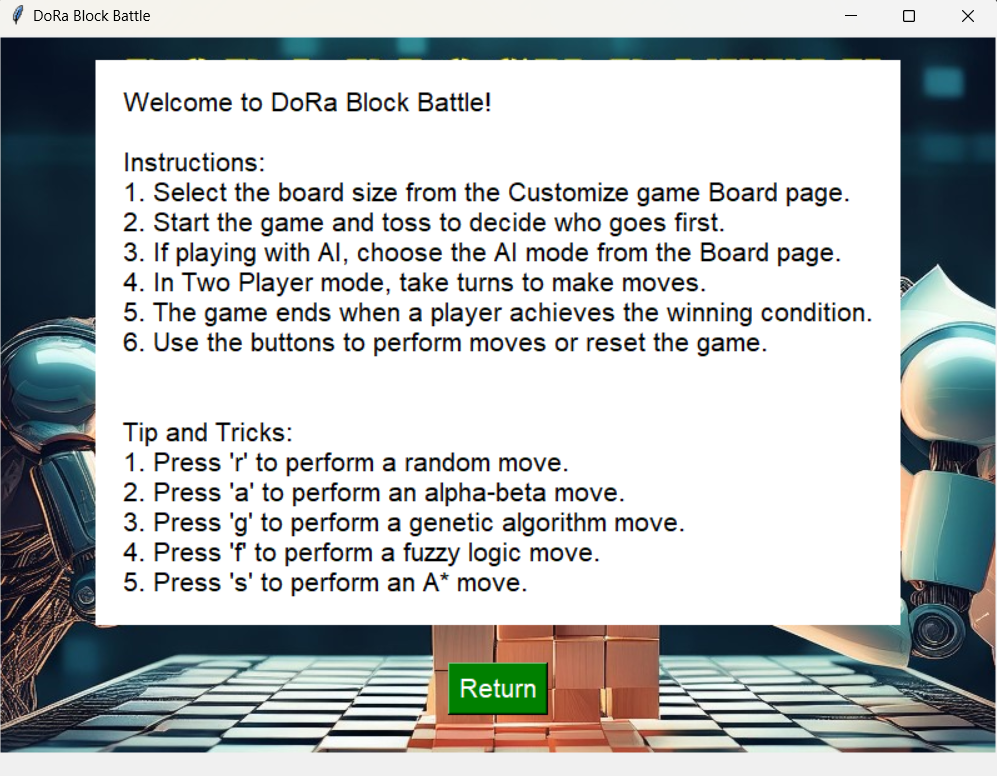

## Introduction
**DoRa Block Battle** is an interactive game built with Python's Tkinter library. This project demonstrates the application of multiple AI algorithms, including **MinMax**, **Alpha-Beta Pruning**, **Genetic Algorithm**, **Fuzzy Logic**, and **A***, to create a responsive and challenging game environment. By integrating these algorithms, This game has integrated complex decision-making in AI, showcasing how various approaches can improve the player experience and game mechanics.

## Objectives

1. **Tkinter-Based Game Interface**: Creating an intuitive game interface using Tkinter, a popular Python library for GUI development.
2. **AI Algorithms for Gameplay**: Integrating multiple AI algorithms to enhance the intelligence and strategy in the game.
3. **Adaptive Experience**: Designing the game to be interactive and adaptive, offering both single-player and multi-player modes.
4. **Responsive Design**: Ensuring the game adapts well to different screen sizes for a smooth user experience.
5. **Comprehensive Instructions**: Providing clear instructions to help players understand the game rules and AI functions.

## Theory
### MinMax Algorithm
The **MinMax** algorithm is a classic AI strategy used in two-player games. It helps the AI evaluate all possible moves and select the one with the most favorable outcome by considering the optimal responses from the opponent.

### Alpha-Beta Pruning
**Alpha-Beta Pruning** is an optimization technique for the MinMax algorithm. It skips evaluating moves that won’t affect the outcome, significantly reducing the number of calculations and making the AI faster.

### Genetic Algorithm
The **Genetic Algorithm** mimics evolutionary processes to generate effective strategies. It iterates through generations of potential moves, applying operations like selection, crossover, and mutation to evolve and refine strategies over time.

### Fuzzy Logic
**Fuzzy Logic** deals with approximate reasoning, making it useful in scenarios where exact answers aren’t necessary. In this game, it helps the AI make decisions based on general rules rather than specific calculations, allowing it to handle ambiguous or uncertain situations.

### A* Algorithm
The **A* Algorithm** is commonly used for pathfinding and navigating between points. It calculates the cost to reach the goal while balancing speed and accuracy, making it ideal for finding efficient paths through the game state.

## Methodology
### Game Rules
**DoRa Block Battle** is played on an NxN matrix. After a toss, each player is assigned a specific move type:
- **Vertical Move**: Occupies two consecutive vertical cells.
- **Horizontal Move**: Occupies two consecutive horizontal cells.

### Algorithm Application
The AI uses different algorithms based on the game state:
- **MinMax**: Evaluates moves and selects the one leading to the best possible outcome.
- **Alpha-Beta Pruning**: Optimizes MinMax by cutting off irrelevant branches.
- **Genetic Algorithm**: Evolves strategies by iterating through a population of potential moves.
- **Fuzzy Logic**: Scores moves based on board position, with moves closer to the center being favored.
- **A\* Algorithm**: Helps in efficiently navigating complex game states by prioritizing moves with lower costs.

## Design
The game has several key pages to enhance user experience:
- **Main/Menu Page**: Displays the main options, including "Start," "Customize," and "Instructions."

    
    
<em>Figure 1: Main/Menu Page</em>

- **Toss Page**: Determines each player’s move type (Vertical or Horizontal).

    
    
    
<em>Figure 2: Toss Page</em>

- **Game Board Page**: Shows the game interface, including different views of the board state.

    
    
    
    
<em>Figure 3: Game Board Page</em>

- **Customize Page**: Allows players to modify settings, including board size and move types.

    
    
<em>Figure 4: Customize Page</em>

  

- **Instructions Page**: Provides a guide on game rules and controls.

    
    
<em>Figure 1: Instruction Page</em>

## Implementation
Each AI algorithm is implemented with a focus on improving gameplay:
- **MinMax Algorithm**: Used to determine optimal moves by evaluating potential game outcomes.
- **Alpha-Beta Pruning**: Increases efficiency by reducing unnecessary calculations in the MinMax process.
- **Genetic Algorithm**: Generates strategic moves by simulating evolution.
- **Fuzzy Logic**: Assesses moves based on their location, prioritizing those closer to the board center.
- **A* Algorithm**: Provides efficient navigation through game states.

## Results and Discussion
### Performance Comparison
| Algorithm            | Performance       |
|----------------------|-------------------|
| Alpha-Beta Pruning   | Best              |
| Genetic Algorithm    | Good              |
| Fuzzy Logic          | Moderate          |
| A* Algorithm         | Least Effective   |

In testing, **Alpha-Beta Pruning** was the most effective for decision-making, as it thoroughly evaluates potential moves. **Genetic Algorithm** also performed well, balancing effectiveness with efficiency. **Fuzzy Logic** was moderately effective, handling uncertainty well but not as precise as other methods. **A*** was the least effective for this specific game, as its pathfinding focus is less suited to strategic decision-making.

